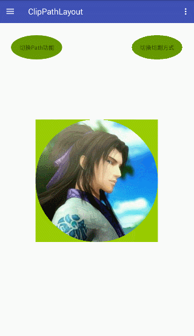
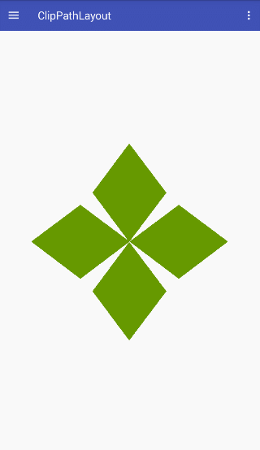
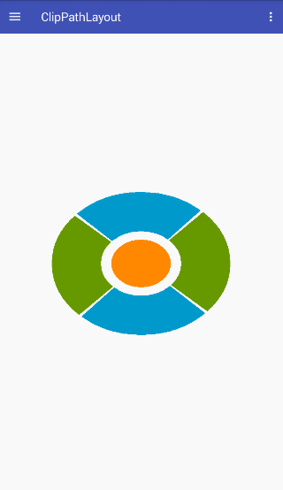
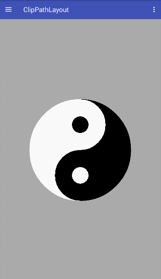
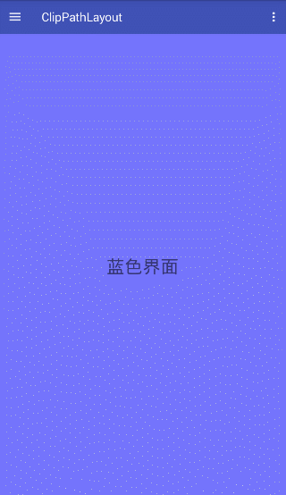
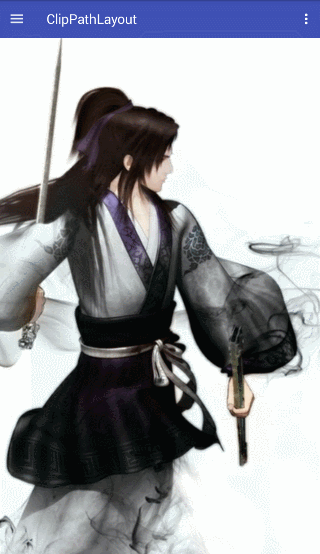

# ClipPathLayout
[](https://www.jitpack.io/#dqh147258/ClipPathLayout)
[]()
[](https://www.apache.org/licenses/LICENSE-2.0)

A layout for implementing irregular shapes in Android 

and the extended transition animation layout.


## Demonstration

### Irregular Shapes

Crop a square image into a circle and make the corners of the circle view not receive touch events.




Many games have directional buttons, and I once made a small game. However, when making the directional buttons, I encountered a problem where the positions of the four directional buttons overlapped, causing local areas to be accidentally touched.
At that time, there was no particularly good solution, only to create a custom view, and a custom view is particularly cumbersome, which requires overriding the onTouchEvent and onDraw to calculate which direction the drop point belongs to and adding a click effect.
Simple custom views lose many of Android's built-in features, and supporting these features is tedious and complex.
Below, with the help of ClipPathLayout, a direction control key implemented with four diamond buttons solves this problem very well.



The simulation of the buttons on the remote control has the same problem as mentioned above and can generally only be implemented by custom views, which is more cumbersome.
The following are the remote control buttons implemented with ClipPathLayout. Since there is no graphic designer to cut the picture, it looks quite ugly. Just bear with it.



We can even turn discontinuous graphics into a single view, such as making a yin-yang fish button.




### Transition Animation

The scene switching effect of two views. Most of the native scene switching effects in Android are achieved through animation, such as translation, reduction, and dimming.
Native rarely comes with the switching effect of a PowerPoint presentation, and the effects implemented by some third-party libraries are generally achieved by adding a layer of view in DecorView to achieve a more harmonious switching effect.
This kind of animation is great, but there is also a small drawback that during the switching process, the view used for switching and the view about to be switched have nothing to do with each other.
With the TransitionFrameLayout extended by ClipPathLayout, a more harmonious switching effect can also be achieved. Since this is an example, not too complicated scenarios are written. The following uses only two TextViews for display.



When browsing QQ space and using QQ browser, I saw Tencent's advertising switching effect, which is also very good. With the help of TransitionFrameLayout, this effect can also be achieved.


In fact, most scene switching should be used in Fragment. Here, the Fragment scene switching effect is also implemented using TransitionFragmentContainer.



## Usage

### Add Dependency

```
	allprojects {
		repositories {
			...
			maven { url 'https://www.jitpack.io' }
		}
	}
```

Add the dependency in the app module's build.gradle:

```
	dependencies {
	        implementation 'com.github.dqh147258:ClipPathLayout:1.1.0'
	}
```

If still using the Jcenter version, it is:
```
implementation 'com.yxf:clippathlayout:1.0.+'
```

### Usage of irregular shape layouts

Currently, there are three layouts that support irregular shapes:

- ClipPathFrameLayout
- ClipPathLinearLayout
- ClipPathRelativeLayout

If you have other layout requirements, you can customize them. See [Customize ClipPathLayout](#Customize ClipPathLayout) for more details.

ClipPathLayout is an interface, and all of the above layouts implement this interface and have the functionality of the parent class.


To achieve an irregular shape, we need to operate not on the parent layout, but on the child views. We need to add some information to the child views so that the parent layout knows how to implement the irregular shape.

Let's take the simplest circular view as an example.

Add an ImageView to a ViewGroup that implements the ClipPathLayout interface (using ClipPathFrameLayout as an example).
```
<com.yxf.clippathlayout.impl.ClipPathFrameLayout xmlns:android="http://schemas.android.com/apk/res/android"
    android:id="@+id/clip_path_frame_layout"
    android:layout_width="match_parent"
    android:layout_height="match_parent">

    <ImageView
        android:id="@+id/image"
        android:layout_width="300dp"
        android:layout_height="300dp"
        android:layout_gravity="center"
        android:src="@mipmap/image" />

</com.yxf.clippathlayout.impl.ClipPathFrameLayout>

```

```
mImageView = mLayout.findViewById(R.id.image);
```

Then build a PathInfo object.

```
new PathInfo.Builder(new CirclePathGenerator(), mImageView)
    .setApplyFlag(mApplyFlag)
    .setClipType(mClipType)
    .setAntiAlias(false)
    .create()
    .apply();
```

Done! You can now see a circular view by running the code.


It's similar to the image in the effect display, but with a few more buttons. The circular view has a green background, which is used for comparison. A green view is added under that view. Don't worry about these details...

Explanation of the parameters and methods used:

#### PathInfo.Builder

PathInfo builder, used to configure and generate PathInfo.

The constructor is defined as follows.
```
        /**
         * @param generator Path生成器
         * @param view 实现了ClipPathLayout接口的ViewGroup的子View
         */
        public Builder(PathGenerator generator, View view) {

        }
```

#### PathGenerator

CirclePathGenerator is an implementation of the PathGenerator interface, used to generate circular paths.

PathGenerator is defined as follows.

```
public interface PathGenerator {

    /**
     * @param old 以前使用过的Path,如果以前为null,则可能为null
     * @param view Path关联的子View对象
     * @param width 生成Path所限定的范围宽度,一般是子View宽度
     * @param height 生成Path所限定的范围高度,一般是子View高度
     * @return 返回一个Path对象,必须为闭合的Path,将用于裁剪子View
     *
     * 其中Path的范围即left : 0 , top : 0 , right : width , bottom : height
     */
    Path generatePath(Path old, View view, int width, int height);

}
```
PathGenerator is the core of the implementation. The parent layout will clip the child view based on this to achieve an irregular shape.

This library includes four built-in Path generators:

- CirclePathGenerator(Circular Path Generator)
- OvalPathGenerator(Ellipse Path Generator)
- RhombusPathGenerator(Diamond Path Generator)
- OvalRingPathGenerator(Ellipse Ring Path Generator)

If there are other complex paths, you can implement your own PathGenerator by referring to the generation of the yin-yang fish path in the example.

#### ApplyFlag

The application flags of Path include the following:

- APPLY_FLAG_DRAW_ONLY(used for drawing only)
- APPLY_FLAG_TOUCH_ONLY(used for touch events only)
- APPLY_FLAG_DRAW_AND_TOUCH(used for both drawing and touch events)

If not set, the default is APPLY_FLAG_DRAW_AND_TOUCH.

The switching effect is as follows:


#### ClipType

There are two types of clipping modes for Path:

- CLIP_TYPE_IN(the inner area of the Path is used as the shape of the irregular subview)
- CLIP_TYPE_OUT(the outer area of the Path is used as the shape of the irregular subview)

If not set, the default mode is CLIP_TYPE_IN.

The switching effects are as follows:


#### AntiAlias

Antialiasing is a feature that can be turned on or off for Path. It is turned off by default. 

Enabling this feature will turn off hardware acceleration and create a new layer. During View drawing, there is also an image generation process, so enabling this feature will seriously reduce drawing performance and cause memory shaking if the interface is frequently refreshed. Therefore, this feature is only recommended for static and infrequently refreshed situations.

### Custom ClipPathLayout

To create a custom ClipPathLayout, first select a ViewGroup and implement the ClipPathLayout interface. 

Then create a ClipPathLayoutDelegate object in the custom ViewGroup.

```
ClipPathLayoutDelegate mClipPathLayoutDelegate = new ClipPathLayoutDelegate(this);
```

And then delegate all the ClipPathLayout interface implementations to the ClipPathLayoutDelegate. 

Here are two important points to keep in mind:

- You need to override the ViewGroup's drawChild method, as follows:

```
    @Override
    protected boolean drawChild(Canvas canvas, View child, long drawingTime) {
        beforeDrawChild(canvas, child, drawingTime);
        boolean result = super.drawChild(canvas, child, drawingTime);
        afterDrawChild(canvas, child, drawingTime);
        return result;
    }
```

- The requestLayout method also needs to be overridden, which is a method shared by both ViewGroup and ClipPathLayout. This method will be called in the constructor of the parent ViewGroup. At this time, the mClipPathLayoutDelegate has not been initialized yet. If called directly, a null pointer exception will occur, so a null check is required.

```
    @Override
    public void requestLayout() {
        super.requestLayout();
        // the request layout method would be invoked in the constructor of super class
        if (mClipPathLayoutDelegate == null) {
            return;
        }
        mClipPathLayoutDelegate.requestLayout();
    }
```
Here is the source code for ClipPathFrameLayout as a example

```
public class ClipPathFrameLayout extends FrameLayout implements ClipPathLayout {

    ClipPathLayoutDelegate mClipPathLayoutDelegate = new ClipPathLayoutDelegate(this);

    public ClipPathFrameLayout(@NonNull Context context) {
        this(context, null);
    }

    public ClipPathFrameLayout(@NonNull Context context, @Nullable AttributeSet attrs) {
        this(context, attrs, 0);
    }

    public ClipPathFrameLayout(@NonNull Context context, @Nullable AttributeSet attrs, int defStyleAttr) {
        super(context, attrs, defStyleAttr);
    }

    @Override
    public boolean isTransformedTouchPointInView(float x, float y, View child, PointF outLocalPoint) {
        return mClipPathLayoutDelegate.isTransformedTouchPointInView(x, y, child, outLocalPoint);
    }

    @Override
    public void applyPathInfo(PathInfo info) {
        mClipPathLayoutDelegate.applyPathInfo(info);
    }

    @Override
    public void cancelPathInfo(View child) {
        mClipPathLayoutDelegate.cancelPathInfo(child);
    }

    @Override
    public void beforeDrawChild(Canvas canvas, View child, long drawingTime) {
        mClipPathLayoutDelegate.beforeDrawChild(canvas, child, drawingTime);
    }

    @Override
    public void afterDrawChild(Canvas canvas, View child, long drawingTime) {
        mClipPathLayoutDelegate.afterDrawChild(canvas, child, drawingTime);
    }

    //the drawChild method is not belong to ClipPathLayout ,
    //but you should rewrite it without changing the return value of the method
    @Override
    protected boolean drawChild(Canvas canvas, View child, long drawingTime) {
        beforeDrawChild(canvas, child, drawingTime);
        boolean result = super.drawChild(canvas, child, drawingTime);
        afterDrawChild(canvas, child, drawingTime);
        return result;
    }

    //do not forget to rewrite the method
    @Override
    public void requestLayout() {
        super.requestLayout();
        // the request layout method would be invoked in the constructor of super class
        if (mClipPathLayoutDelegate == null) {
            return;
        }
        mClipPathLayoutDelegate.requestLayout();
    }

    @Override
    public void notifyPathChanged(View child) {
        mClipPathLayoutDelegate.notifyPathChanged(child);
    }

    @Override
    public void notifyAllPathChanged() {
        mClipPathLayoutDelegate.notifyAllPathChanged();
    }
}
```


### Usage of Transition Animation Layout

There are two types of transition animation layouts available, one for normal views (TransitionFrameLayout) and another for fragment containers (TransitionFragmentContainer).

#### TransitionFrameLayout

This layout inherits from FrameLayout and is used for switching between two views.

It requires that the two child views have the same size and position. If no special settings are applied, FrameLayout will handle this automatically.

**This ViewGroup can only display one view at a time**,If multiple views are added in XML,**only the last one will be displayed**.

To add a view or show a hidden view, use the switchView method of TransitionFrameLayout instead of directly calling addView or setVisibility. This will avoid undesired visual effects.


##### Usage

Here is an example of using TransitionFrameLayout to switch between two TextView

```
<com.yxf.clippathlayout.transition.TransitionFrameLayout xmlns:android="http://schemas.android.com/apk/res/android"
    android:layout_width="match_parent"
    android:layout_height="match_parent">

    <TextView
        android:id="@+id/blue_view"
        android:layout_width="match_parent"
        android:layout_height="match_parent"
        android:background="#880000ff"
        android:gravity="center"
        android:text="蓝色界面"
        android:textSize="30sp" />

    <TextView
        android:id="@+id/green_view"
        android:layout_width="match_parent"
        android:layout_height="match_parent"
        android:background="#8800ff00"
        android:gravity="center"
        android:text="绿色界面"
        android:textSize="30sp" />

</com.yxf.clippathlayout.transition.TransitionFrameLayout>
```

```
mLayout = (TransitionFrameLayout) inflater.inflate(R.layout.fragment_view_transition, null);
```

The green interface is currently displayed on top, while the blue interface is hidden.

If you need to toggle the blue interface, you can use the following code.

```
TransitionAdapter adapter = mLayout.switchView(mBlueView);
```
switchView has two methods.
```
    @Override
    public TransitionAdapter switchView(View view) {
        return switchView(view, false);
    }

    /**
     * if you want add a view , just invoke switchView directly ,
     * do not invoke addView , it may cause some problem .
     *
     * @param view
     * @return
     */
    @Override
    public TransitionAdapter switchView(final View view, boolean reverse) {
        //.................
    }
```
"reverse" set to false indicates the animation is expanding, and set to true means it's shrinking.

After calling "switchView", you can obtain an adapter object, but the blue interface is not displayed yet.

You can get a ValueAnimator or a Controller object through the adapter.

You can directly call:

```
adapter.animate();
```

to start the scene transition animation effect.

Alternatively, you can get an animation property through:
```
adapter.getAnimator();
```
to control the animation process yourself.

You can also get a Controller object through:
```
mController = adapter.getController();
```
Then control the animation implementation progress by calling:
```
mController.setProgress
```
When the progress reaches 1 (progress range 0~1), which means the animation is finished, you can call:
```
adapter.finish();
```
to notify the end of the transition.

The effect of using "adapter.animate()" directly is as follows


#### TransitionFragmentContainer

This layout serves as a container for Fragment to achieve the scene transition effect. 

You can add and delete it dynamically just like using a FrameLayout as a Fragment container.

The effect is as follows


#### TransitionAdapter

This class is a Path adapter, constructed as follows

```
public TransitionAdapter(PathGenerator generator)
```

The adapter needs to obtain the maximum rectangular area that a Path can hold to determine the minimum enlargement Scale for the best visual effect. Currently, a binary search method is used to obtain this rectangular area, but this method has a drawback. For Paths with hollow centers, this method is not feasible. Therefore, for this situation, a TransitionPathGenerator interface is added, defined as follows

```
public interface TransitionPathGenerator extends PathGenerator {

    /**
     * @param similar Similar rectangle reference
     * @param boundWidth Width of Path range
     * @param boundHeight Height of Path range
     * @return Returns the largest rectangle area that is similar to the @param similar.
     * The center of the returned rectangle must be the center of the Path, which is (boundWidth/2, boundHeight/2).
     * To minimize memory jitter, it is recommended to modify the rectangle passed in as a parameter and return it.
     */
    Rect maxContainSimilarRange(Rect similar, int boundWidth, int boundHeight);

}
```

If there are particularly special Paths (such as those with hollow centers) that require a custom-contained rectangular area, you can implement this interface and pass it as a constructor parameter to the TransitionAdapter.

Returning to TransitionAdapter,
both of the above two transition animation containers have a "setAdapter" method that can replace the default TransitionAdapter.

After obtaining the Adapter from "TransitionFrameLayout.switchView", you can also control the expansion and contraction center of the Path by calling "setPathCenter". The default PathCenter is the center of the View.

## Principle Analysis

[Android中不规则形状View的布局实现](https://www.jianshu.com/p/178c9efcdb44)

[基于ClipPathLayout转场动画布局的实现](https://www.jianshu.com/p/0c7d4214fabe)

---

